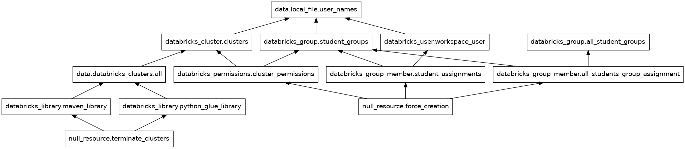

# Using Terraform to deploy DataBricks clusters for students

Students are divided to groups (usually 3 or 4 people).  Each group is allocated its own cluster.

This simple setup requires:
- creating clusters
- creating groups
- creating users
- connecting the above
- setting correct permissions
- Installing needed libraries on each cluster (both JAR and python)
- turning off the clusters after creation (to save money)

In practice, the group list is dynamic, so we need to be able to update the setup accordingly, without affecting existing users.

<!-- START doctoc generated TOC please keep comment here to allow auto update -->
<!-- DON'T EDIT THIS SECTION, INSTEAD RE-RUN doctoc TO UPDATE -->
**Table of Contents**

- [Using Terraform to deploy DataBricks clusters for students](#using-terraform-to-deploy-databricks-clusters-for-students)
- [Usage](#usage)
  - [Modifying properties in existing deployment](#modifying-properties-in-existing-deployment)
- [Installing libraries](#installing-libraries)
- [Using the same code to create different environments](#using-the-same-code-to-create-different-environments)
  - [Profiles](#profiles)
  - [Workspace](#workspace)
- [Testing !](#testing-)
  - [Debugging](#debugging)
  - [Setting and choosing  a workspace](#setting-and-choosing--a-workspace)
- [History timeline](#history-timeline)

<!-- END doctoc generated TOC please keep comment here to allow auto update -->

# Usage

1. Download a CSV file from Moodle with 1 or more users (must be email address) in each row. This is an export of the "Students create groups"<br>
Transform this file using `python convert_moodle_to_tf_format.py path/to/the/csv/file` .

The output is named  "users.csv" <br>
Place the `users.csv` file in the `terraform/dbr` folder

2. Create a Databricks workspace (I use Azure portal).
1. generate a Databricks personal token
  - enter the workspace, user settings,  developer tools, manage access tokens, generate new token with short life span (e.g. 2 days).
  - store it as  `TF_VAR_databricks_token=dapia****` in a **safe** place for env variables. Make sure it persists after the current shell is terminated :)

1. login to the correct DBR profile:
  `databricks auth login --host adb-3738544368441327.7.azuredatabricks.net`
  This will open the browser and let you login.
  The "adb***" is copied from the URL shown in the browser when entering the workspace.

  Calling this command writes a file `~/.databrickscfg`

Originally it looked like:

```
; The profile defined in the DEFAULT section is to be used as a fallback when no profile is explicitly specified.
[DEFAULT]

[adb-3738544368441327 ]
host      = adb-3738544368441327.7.azuredatabricks.net
auth_type = databricks-cli
```

And to make the `terraform apply` work, I edited it to:
```
; The profile defined in the DEFAULT section is to be used as a fallback when no profile is explicitly specified.
[DEFAULT]
host      = adb-3738544368441327.7.azuredatabricks.net
auth_type = databricks-cli
```

**Additionally**, you must export these env vars (case sensitive!)
```
TF_VAR_databricks_token
TF_VAR_databricks_host
````
>NOTE: <br>
> Some actions (resources?) can be done ONLY after finishing the deployment
> of clusters. Specifically, to install libraries, the cluster need to be ready.
> Specifying it automatically did not work for me, so I use semi-manual
> dependency.


1. run `terraform plan --target=null_resource.force_creation`. check that the plan is reasonable.
1. `terraform apply --target=null_resource.force_creation`. After it finished, check that the resources in the Databricks portal are as expected: users created, they are in the correct group, the group has correct permissions in the correct cluster. All cluster should be turned ON. <br>
 *It will take a few minutes*
2. Now that the clusters are created and running, apply the second half -- installing libs and shutting down the clusters:<br> `terraform apply`


> NOTE: I strongly recommend increasing the default parallelism (10 resources) - e.g. `terraform apply -parallelism=50`


## Modifying properties in existing deployment
You may want to add/remove user, or change the auto-termination, max_workers etc.

Simply update the relevant data file (the CSV or the terraform.tfvars) and `terraform apply` again.


# Installing libraries

First, see https://technionmail-my.sharepoint.com/:w:/r/personal/cnoam_technion_ac_il/_layouts/15/Doc2.aspx?action=edit&sourcedoc=%7Bdff4d25f-d6a5-4b3a-8372-13e6b19c814c%7D&wdOrigin=TEAMS-WEB.undefined_ns.rwc&wdExp=TEAMS-TREATMENT&wdhostclicktime=1734868535555&web=1

Examine the code in `install_libs.tf`
> TIP: See the comment on parallelism
<br><br>

# Using the same code to create different environments
Imagine you want to run the same plan to generate workspaces for two courses. Each of them has different users/clusters and possibly cluster configurations. This is what PROFILES are.

## Profiles

You create profiles in `~/.databrickscfg` :
```
[default]
host="adb-3663658524550853.13.azuredatabricks.net"
token=dapi***

[lab94290]
host      ="adb-3738544368441327.7.azuredatabricks.net"
token=dapi***

[lab94290-integration-test]
host="adb-3663658524550853.13.azuredatabricks.net"
token=dapi6***
```

### Choosing which profile to run
And then run `tf apply --profile=lab94290-integration-test` at least in theory. *I could not make it work*, so moved to Workspace method, and left the profile for future work.

## Workspace
Create a different workspace for production and for testing.

Check that the workspace credentials are working: <br>
`databricks workspace list --profile lab94290-integration-test /Users`

You should see something like 
```
$ databricks workspace list --profile lab94290-integration-test /Users
ID                Type       Language  Path
2733568086785891  DIRECTORY            /Users/cnoam@technion.ac.il
```

Create a new workspace: `tf workspace new test` # tf is alias for terraform


# Testing !

In order to test, use a different environment. Do NOT work on the production.
Each env has its own state, so they must be separated. 

This can be done using TF workspace, or directories (or more complex methods).
We are currently using Workspace.

[The reason NOT to use directories is it causes code duplication, at least according to my current understanding]

## Debugging
Try adding the env var: `TF_LOG=DEBUG terraform apply --target=null_resource.force_creation`
It also works for VERBOSE

### Checking the dependency graph
Sometimes it is helpful to see the dependency graph: `tf graph > graph.dot && dot -Tpng graph.dot -o graph.png`

You will get something like


## Setting and choosing  a workspace
 WORK IN PROGRESS

 try `tf workspace --help`

---
# History timeline
2024-06-27 16:31

Try to migrate all the configurations done in my python code to using terraform.
The python code is complex, and I found out that MS/DBR silently breaks the REST API.

https://registry.terraform.io/providers/databricks/databricks/latest/docs

 Note: the credentials are read from ~/.databrickscfg. Make sure they are for the workspace of interest, or the operations will be carried on the wrong WS! Also, the env vars have higher precedence.

2024-06-27 16:37 the installed databricks cli is too old (0.18)
2024-06-27 16:58 installed the newest version (0.222)

I logged in to the correct DBR workspace:

`databricks auth login --host adb-2308486504415649.9.azuredatabricks.net`

When calling `apply` I keep getting

Error: Inconsistent dependency lock file
│ 
│ The following dependency selections recorded in the lock file are inconsistent with the current configuration:
│   - provider registry.terraform.io/databricks/databricks: required by this configuration but no version is selected

so I deleted the state files and ran tf init. Still get the same error.

Even creating a new dir and starting only with the main.tf did not help.


2024-06-27 18:13 finally , after tf init --upgrade and voodoo, I can create a workspace user and delete it. 
If I try to change a field (display_name) I get error that the user already exists. if I then try to destroy it, I get error that it does not exist.

The display name is not taken from the tf file.

2024-09-01 
At last the whole scenario is working: reading a CSV file; creating users, groups, clusters and associating them correctly.


2024-12-25
Trying to install lib (JAR + py). First, they depend on having running cluster, and (According to GPT), specifying dependency did not work, so I use 2 phase apply (using --target).
When trying to install libs (in my test workspace)it did not finish. (4 clusters).
I commented the MVN (leaving only py), and still not finished. 
Opened the portal, manually turned on the clusters and then ran the plan --> this time it completed ok.

==> after cluster creation, do not terminate them. Delay termination after installing libs

