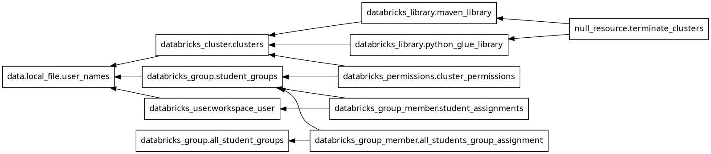

# Using Terraform to deploy DataBricks clusters for students

Students are divided to groups (usually 3 or 4 people).  Each group is allocated its own cluster.

This simple setup requires:
- creating clusters
- creating groups
- creating users
- connecting the above
- setting correct permissions
- Installing needed libraries on each cluster (both JAR and python)
- turning off the clusters after creation (to save money)

In practice, the group list is dynamic, so we need to be able to update the setup accordingly, without affecting existing users.

<!-- START doctoc generated TOC please keep comment here to allow auto update -->
<!-- DON'T EDIT THIS SECTION, INSTEAD RE-RUN doctoc TO UPDATE -->
**Table of Contents**

- [Using Terraform to deploy DataBricks clusters for students](#using-terraform-to-deploy-databricks-clusters-for-students)
- [Installation](#installation)
- [Usage](#usage)
  - [Modifying properties in existing deployment](#modifying-properties-in-existing-deployment)
- [Installing libraries](#installing-libraries)
- [Using the same code to create different environments](#using-the-same-code-to-create-different-environments)
  - [DBR Profiles](#dbr-profiles)
  - [TF Workspace](#tf-workspace)
- [Testing !](#testing-)
- [Preparing dev workspace](#preparing-dev-workspace)
  - [Debugging](#debugging)
    - [Checking the dependency graph](#checking-the-dependency-graph)
- [Using local state file for development](#using-local-state-file-for-development)
- [Troubleshooting](#troubleshooting)
  - [Mismatch between the state known by TF and the actual state in the cloud](#mismatch-between-the-state-known-by-tf-and-the-actual-state-in-the-cloud)
  - ["Error: failed to find the installed library"](#error-failed-to-find-the-installed-library)
  - [Deleting resources temporarily - for debugging](#deleting-resources-temporarily---for-debugging)
- [History timeline](#history-timeline)

<!-- END doctoc generated TOC please keep comment here to allow auto update -->

# Installation
Tested on ubuntu 24.04 Desktop
1. Install terraform from ubuntu repos

1. Install databricks cli <br>
 Use curl:  https://learn.microsoft.com/en-us/azure/databricks/dev-tools/cli/install#curl-install
1. Install Azure cli (az cli). It is needed for authorization access to Azure Storage account where the TF state is kept.<br>
 see https://learn.microsoft.com/en-us/cli/azure/install-azure-cli-linux?pivots=apt   <br>
    I had to use the manual method of adding Microsoft PPA. 
1. run `az login` , and choose the correct subscription. I  placed the key in a container in storage account in subscription "DDS - TeachingLab"
1. run `tf init`


# Usage

1. Download a CSV file from Moodle with 1 or more users (must be email address) in each row. This is an export of the "Students create groups"<br>
Transform this file using `cd dbr && python ../convert_moodle_to_tf_format.py path/to/the/csv/file` .

The output is named  "users.csv" <br>

2. Create a Databricks workspace (I use Azure portal).
1. generate a Databricks personal token or the CLI's hidden token (next item)
  - enter the workspace, user settings,  developer tools, manage access tokens, generate new token.
 

3. Configure Databricks Profiles:
   - Use the Databricks CLI: `databricks auth login --host <workspace-url>`.
   - Example `~/.databrickscfg`:
     ```ini
     [lab-dev]
     host = [https://adb-xxx.azuredatabricks.net](https://adb-xxx.azuredatabricks.net)
     auth_type = databricks-cli
     
     [lab-prod]
     host = [https://adb-yyy.azuredatabricks.net](https://adb-yyy.azuredatabricks.net)
     auth_type = databricks-cli
     ```

4. Map TF Workspaces to Profiles:
   - In `terraform.tfvars`, map TF workspace names to profile names:
     ```hcl
     workspace_profiles = {
       dev  = "lab-dev"
       prod = "lab-prod"
     }
     ```

5. Safety Check:
   - The `safety.tf` file prevents execution if the TF workspace is not mapped.

>NOTE: <br>
> Some actions (resources?) can be done ONLY after finishing the deployment
> of clusters. Specifically, to install libraries, the cluster need to be ready.
> Specifying it automatically did not work for me, so I use semi-manual
> dependency.

> NOTE: the following instructions might be not needed. Try to run `tf apply --parallelim=50` and maybe you are lucky.
1. run `terraform plan --target=null_resource.force_creation`. check that the plan is reasonable.
2. `terraform apply --target=null_resource.force_creation`. After it finished, check that the resources in the Databricks portal are as expected: users created, they are in the correct group, the group has correct permissions in the correct cluster. All cluster should be turned ON. <br>
 *It will take a few minutes* : Creating a cluster takes about 5 minutes. (This is why parallel is so important)
1. Now that the clusters are created and running, apply the second half -- installing libs and shutting down the clusters:<br> `terraform apply`


> NOTE: I strongly recommend increasing the default parallelism (10 resources) - e.g. `terraform apply -parallelism=50`

> `export TF_CLI_ARGS_apply="-parallelism=50"`


## Modifying properties in existing deployment
You may want to add/remove user, or change the auto-termination, max_workers etc.

Simply update the relevant data file (the CSV or the terraform.tfvars) and `terraform apply` again.


# Installing libraries

First, see https://technionmail-my.sharepoint.com/:w:/r/personal/cnoam_technion_ac_il/_layouts/15/Doc2.aspx?action=edit&sourcedoc=%7Bdff4d25f-d6a5-4b3a-8372-13e6b19c814c%7D&wdOrigin=TEAMS-WEB.undefined_ns.rwc&wdExp=TEAMS-TREATMENT&wdhostclicktime=1734868535555&web=1

Examine the code in `install_libs.tf`
> TIP: See the comment on parallelism
<br><br>

> NOTE: installing/removing libraries requires the cluster is UP. If it is currently terminated, the operation may time out before the cluster has enough time become UP. 

# Using the same code to create different environments
Imagine you want to run the same plan to generate workspaces for two courses. Each of them has different users/clusters and possibly cluster configurations. This is what PROFILES are.

## DBR Profiles

A Databricks profile is a set of configuration details—such as credentials, workspace URL, and other settings—used by the Databricks CLI or client libraries to securely connect to and interact with a specific Databricks workspace.

Profiles are now the primary way to authenticate. The `provider` block in `main.tf` uses a `lookup` to find the correct profile based on your active TF workspace.

```hcl
provider "databricks" {
  profile = lookup(var.workspace_profiles, terraform.workspace, null)
}
```


## TF Workspace
You can create a different TF workspace for production and for testing.

> WARNING:
`TF Workspace` is a different concept from `DBR workspace`

**Databricks workspace** is the environment where you access Databricks services, run workloads, manage data, and collaborate on notebooks, models, and experiments.

In **Terraform, a workspace** is an isolated state environment. By creating multiple workspaces, you can reuse the same configuration for different environments (e.g., staging, production) while keeping their state data (tracked infrastructure) separate.

> The DBR command below uses credentials from .databrickscfg . **It is not related to the TF workspace** <br>
> so you can have TF workspace pointing to the testing env, while DBR profile points to the production.
> 
Check that the DBR workspace credentials are working: <br>
`databricks workspace list --profile lab94290-integration-test /Users`

You should see something like 
```
$ databricks workspace list --profile lab94290-integration-test /Users
ID                Type       Language  Path
2733568086785891  DIRECTORY            /Users/cnoam@technion.ac.il
```

- Create a new TF workspace: `tf workspace new test` *# tf is alias for terraform*
- List existing workspaces (as far as I know, they are local to this computer)<br>
`tf workspace list`<br>
- Select workspace: `tf workspace select NAME`

The current architecture enforces a strict 1-to-1 binding between a Terraform workspace and a Databricks profile.

1. Select workspace: `tf workspace select dev`
2. Terraform automatically pulls the host and auth details from the `[lab-dev]` profile in your config.


1. in main.tf , update the AZURE subscription ID
  ```
  # This is the subscription where operations will be executed.
  provider "azurerm" {
    subscription_id = "dfabd25-794a-4610-a071-2dc334da70b7" # second subscription
    features {}
  }
  ```


And finally: `tf apply`

# Testing !

In order to test, use a different environment. Do NOT work on the production.
Each env has its own state, so they must be separated. 

This can be done using TF workspace, or directories (or more complex methods).
We are currently using TF Workspace.

[The reason NOT to use directories is it causes code duplication, at least according to my current understanding]

# Preparing dev workspace
1. in the Azure portal, create a new DBR workspace. It should be in the same region as the storage.
2. run  `databricks auth login --host adb-<<WS-ID>>.azuredatabricks.net`
3. run `tf workspace select dev` (or create it first`tf workspace new dev_94290`)
4. verify `tf plan` fails due to unmatched TF workspace to DBR profile.
5. Add the DBR profile to the list of TF workspace mapping (in main.tf)
6. create a minimal `users.csv`
7. run `tf plan` and check reasonability.
8. 
## Debugging
Try adding the env var: `TF_LOG=DEBUG terraform apply --target=null_resource.force_creation`
It also works for VERBOSE

### Checking the dependency graph
Sometimes it is helpful to see the dependency graph: `tf graph > graph.dot && dot -Tpng graph.dot -o graph.png`

You will get something like


# Using local state file for development
The state file is stored remotely, in an Azure storage. This ensures the state is correct even if multiple users are manipulating it, or the dev computer is dead.

However, locking the state is slow, so during development, you can bring the state locally, and when finished, push it back to remote:

First, create a backup. `terraform state pull > dev.tfstate` 


In main.tf, inside `terraform {}`, comment the remote backend and enable
```
 backend "local" {
    path = "dev.tfstate"
  }
```
then, `terraform init -reconfigure  #tells TF to read the new backend config`

Work as usual (tf plan/apply)
When ready, push the finished state back to the remote backend:
1. update the backend{} to use the remote in main.tf
2. `terraform init  -migrate-state`


# Troubleshooting

**`tf plan` fails with "CRITICAL ERROR: Workspace Mismatch" <br>**
--> You are in a Terraform workspace (like `default` or a new lab ID) that isn't mapped in your `workspace_profiles` variable.
--> Add the workspace to your `.tfvars` map or switch to a valid one: `tf workspace select dev`.

**`tf plan` succeeds, and `tf apply` fails due to auth <br>**
--> It is possible that although you ran "databricks auth login ..." successfully and a new token is stored on your machine, that the provider does not see it due to old version or bugs.

-----> run `tf init` that will freshen the environment

**error: Can't get lock file <br>**
If the `tf apply` fails due to network problem (this is not the only cause) the lock file might still exist, so the next run will fail.  When it happened to me, I used `terraform force-unlock -force LOCK-ID` . See https://jhooq.com/terraform-conidtional-check-failed/

The LOCK-ID is taken from:
```
Error: Error acquiring the state lock
│ 
│ Error message: state blob is already locked
│ Lock Info:
│   ID:        bcc157d7-fbca-e2ac-e1f2-b402a084ccf5
│   Path:      terraform-states/terraform.tfstate
```
When looking in the backend (Azure storageAccount Blob), the lock is seen as status "leased" on the tfvars file.


## Mismatch between the state known by TF and the actual state in the cloud
The first method is to import the actual resources info into the TF state. There are a few methods to do it:
- import a single resource using `tf import`
- using third party tool `terraformer`
- using `az_tf_export (??)` which exports Azure resources to TF format

I did not try any of the above
(2025-09-01), using `tf apply --refresh-only` worked nice!

Another way, is to delete the resources (e.g. cluster, user, group, permission) from the DBR, and then let TF deploy again.
To delete users and groups, I used my python script. Be very careful.


## "Error: failed to find the installed library"
This may happen if TF waits (pending) for the cluster to start, and times out before the cluster becomes ready.

Another possible reason, is that some libraries (specifically spark-nlp) requires cluster restart, and this confuses TF. 
A possible  bypass is to wait a few minutes for the cluster to be up, and then apply again.
If not working, try the 'tf state rm ' to bring the state file into order.


## Deleting resources temporarily - for debugging
For resources known to TF: <br>
`terraform destroy -target=<resource_type.resource_name>`


---
# History timeline
2024-06-27 16:31

Try to migrate all the configurations done in my python code to using terraform.
The python code is complex, and I found out that MS/DBR silently breaks the REST API.

https://registry.terraform.io/providers/databricks/databricks/latest/docs

 Note: the credentials are read from ~/.databrickscfg. Make sure they are for the workspace of interest, or the operations will be carried on the wrong WS! Also, the env vars have higher precedence.

2024-06-27 16:37 the installed databricks cli is too old (0.18)
2024-06-27 16:58 installed the newest version (0.222)

I logged in to the correct DBR workspace:

`databricks auth login --host adb-2308486504415649.9.azuredatabricks.net`

When calling `apply` I keep getting

Error: Inconsistent dependency lock file
│ 
│ The following dependency selections recorded in the lock file are inconsistent with the current configuration:
│   - provider registry.terraform.io/databricks/databricks: required by this configuration but no version is selected

so I deleted the state files and ran tf init. Still get the same error.

Even creating a new dir and starting only with the main.tf did not help.


2024-06-27 18:13 finally , after tf init --upgrade and voodoo, I can create a workspace user and delete it. 
If I try to change a field (display_name) I get error that the user already exists. if I then try to destroy it, I get error that it does not exist.

The display name is not taken from the tf file.

2024-09-01 
At last the whole scenario is working: reading a CSV file; creating users, groups, clusters and associating them correctly.


2024-12-25
Trying to install lib (JAR + py). First, they depend on having running cluster, and (According to GPT), specifying dependency did not work, so I use 2 phase apply (using --target).
When trying to install libs (in my test workspace)it did not finish. (4 clusters).
I commented the MVN (leaving only py), and still not finished. 
Opened the portal, manually turned on the clusters and then ran the plan --> this time it completed ok.

==> after cluster creation, do not terminate them. Delay termination after installing libs


2025-01-05
on newly formatted machine, I am trying to 'tf apply' and get all sorts of errors.

profile: only when disabling provider "databricks" {} and using the [DEFAULT] section in .da*cfg it agreed to continue.

2025-01-07
After solving the "credintials of prod used for test so permission denied", I ran tf apply on the test,
where already there are users and clusters created. 
But now I am in 'testing-DBR' TF workspace, so all the state from before is unknown, and it attempts to create users and groups and fails because they are exists.
The clusters are created, since their name is not unique

I changed `tf workspace select default`, and now `tf apply` correctly identify the current resource.
==> Must be very careful in which workspace I use!!!!

2025-12-23 moved to using TF workspace, with 1:1 binding to DBR profile. Stop using env Vars for this.

